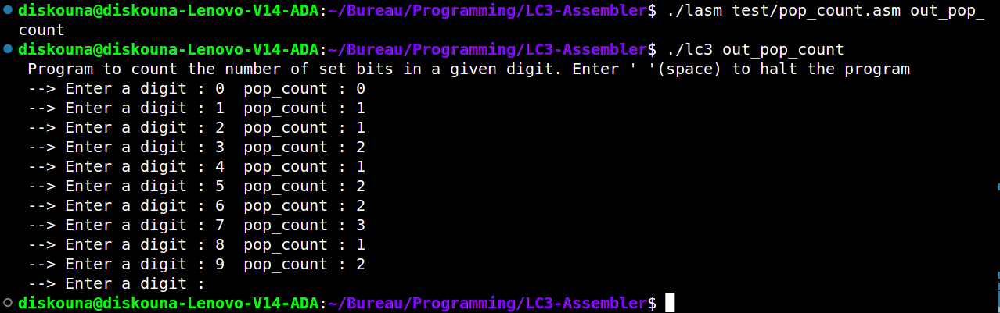
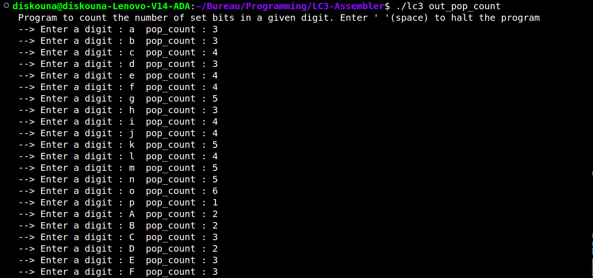

# lasm
A simple LC3 assembler inspired by `Yale N. Patt` and `Sanjay J. Patel` 's book [introduction to
computing systems from bits & gates to C/C++ & beyond]()

## Usage
```console
$ ./lasm input.asm [output.obj] 
$ ./lc3 output.obj
```
## Screenshots 


